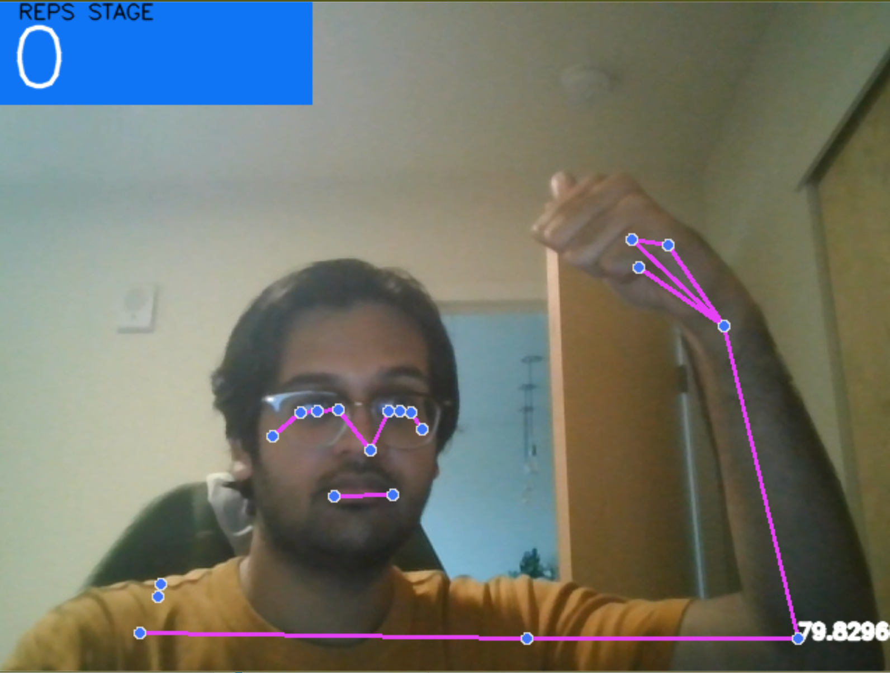

# PoseDetection

## Introduction
Ever since I moved to my new apartment, I've had to get used to using free weights while working out. In order to ensure that my form is immaculate and also to gain more experience with computer vision problems, I made CurlBuddy. 

## Background
CurlBuddy utilizes the mediapipe pose detection model which allows one to get data regarding different landmarks on the body. In the Face_Hand_Detection notebook, you will find a small introduction to mediapipe and how it can be used in tandem with opencv to detect one's face and hands. Building on that, I used a different model that focuses more on your body to obtain data on my left arm (shoulder, elbow, and wrist) and determine the angle between the different parts. Using the angle, I added functionality to determine the stage of the curl that you are in and then counting the reps that you do. 

## Next Steps
The next step for me would be to create similar functionalities for different exercises and then bring them all together to create an application that can serve as a guide to performing exercises correctly and also being able to keep track of one's daily workouts. 

## Demo
Here is an image of the application in effect:

